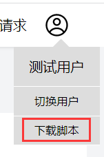

# 用法

## 注册网站
登录[监控系统](http://47.100.57.184:9000/)首页，创建网站实例，获取网站ID

## 下载 SDK
在用户菜单选项中下载监控 SDK


## 导入 SDK
在项目中导入监控脚本
```html
<script src="./bundle.js"></script>
```

## 配置网站ID
调用 `setOption` 方法，传入一个配置对象：
* id: 网站ID
* showDebug: 上报日志的同时是否在控制台打印(用于测试)

```html
<script>
  // 下面是默认选项
  setOption({ id: 1018, showDebug: true })
</script>
```

## 配置完成
只需完成以上配置，就可以在监控系统实时了解线上应用的健康情况

# 仓库结构
* src/err: 异常监控代码
* src/per: 网页性能监控代码
* src/beh: 用户行为监控代码
* src/http: 网络请求监控代码
* src/util: 上报等工具函数
* example/ : 测试网页
* dist/monitoring: 打包生成的监控 jdk

# 开发
## 克隆本仓库
```shell
git clone https://gitee.com/du-hao-111/website-monitoring-script.git
```

## 安装依赖
```shell
pnpm i
```

## 启动服务
```shell
pnpm run dev
```
然后在 exmple 中的测试网页引入脚本，开启Live Server
```html
<script src="/monitoring.js"></script>
```

## 打包
```shell
pnpm run dev build
```

## 提交须知
本仓库配置了commitlint，提交代码需要符合规范，具体可以访问[这篇掘金](https://juejin.cn/post/7091276495972204580)查看
```shell
git add .
git cz
```
